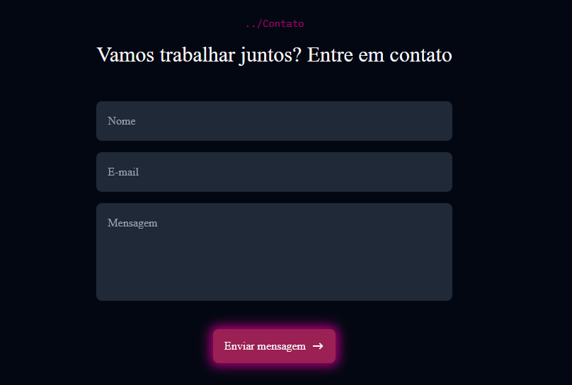
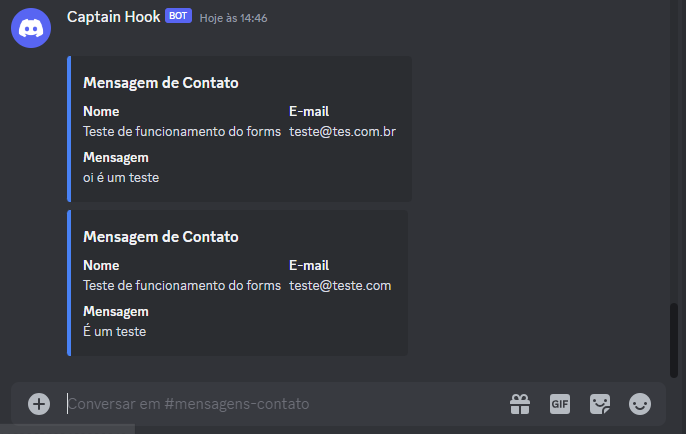

# Integrando um Forms com o Discord

Estudo desenvolvido durante o curso de desenvolvimento de portifolio do [Canal]
(https://www.youtube.com/playlist?list=PLY_G6KZ7jlfU41bdaWpTsOnfCC7bmpJcL) e desenvolvimeto de um tutorial para a Hari-Q. 
Qualquer mensagem que for enviado pelo forms será encaminhado para um servidor do discord. 

## 🚀 Tecnologias

Esse projeto foi desenvolvido com as seguintes tecnologias:

- typescript
- Tailwind
- next.js
- react
- api do discord
- Git e Github 

## 💻 

Layout do projeto. 

Mensagem recebida pelo discord

## 🔖 
Projeto de estudo do next.js e tailwind com integração da api do discord, para criar um forms do qual qualquer mensagem enviada, será recebido em um servidor do discord. 

