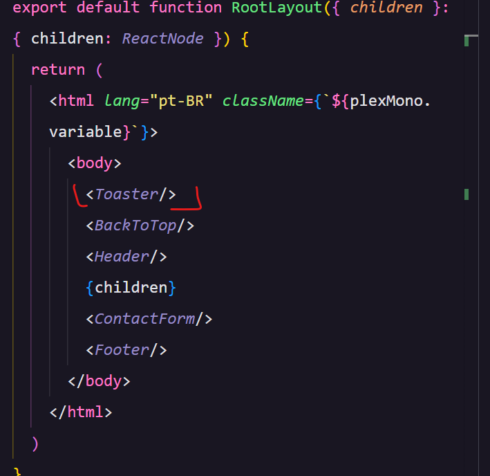

# Forms 
Foi criado um forms para que todo contato que chegar atraves do forms, seja enviado uma mensagem para um canal privado dentro do discord. 
- Nessa documentação será explicado como foi os passo a passo para chegar no resultado esperado.

#### Discord 
 Criar um Canal dentro do servidor no discord, de um nome e clique em próximo. 


- Clique no icone de "engrenagens" 


- Clique em integrações 


- Clique em Criar um webhooks


- Clique em Novo webhooks e clique no que foi criado, renomeie e cópie URL do webhook


- cole o URL cópiado dentro do documento .env.local, pois será atraves dessa URL que será possível fazer a aplicação via API. 


# Exemplo usado no Portifolio da Gleizi
- Cria-se uma pasta que será um component chamado contact-form e dentro crie um arquivo chamado index.tsx. 

 

- Dentro do arquivo você cria o o forms com os campos e estilos que você quer. Nesse exemplo o forms ficou desse jeito em relação aos campos e estilos. 
 

* Adicionando as funcionalidades
  - Será usado o React-hook-forms com Zod (Como está sendo usado um hook é preciso adicionar um 'use-client')

  * Foi criado uma const que passa dois paramentros (heandleSubmit e register) e acrescenta essas partes dentro do formulário para ele se tornar funcional para o usuário, ao acrescentar crio-se o (onSubmite para receber(data) que nada mais e o que tem no formulário ). 


  - Exemplo da funcionando 
   

   - Está vázio pois ele não percebe a existencia dos inputs.

   
  ~~~~typescript
    <input
            placeholder="Nome"
            className="w-full h-14 bg-gray-800 rounded-lg placeholder:text-gray-400 text-gray-50 p-4 focus:outline-none focus:ring-2 ring-[#f868cf]"
            {...register("name")} // essa parte é que precisa adicionar para puxar as informações quando clicar no botão
          />
  ~~~~

* Foi criado uma typagem chamada ContactFormData para deixar claro que tem dados e que quando o usuário clicar ele foca que o input precisa receber dados e o tipo de dados. 
 

 ##### 1ª parte da logica do forms 

 ~~~~ typescript
// o zod foi criado para que desse para usar o register no código e ter o autocomplete, dentro do parentese, passa alguns parametros, como quantidade minima e máxima de caracteres. 

const contactFormSchema = z.object({
  name: z.string().min(3).max(100),
  email: z.string().email(),
  message: z.string().min(1).max(500),
})

type ContactFormData = z.infer<typeof contactFormSchema>
// tipagem para dizer que o ContactFormData tem as informações acima

export const ContactForm = () => {
  const { handleSubmit, register, reset } = useForm<ContactFormData>({
    resolver: zodResolver(contactFormSchema),
    // Ao criar a const com os valores de handleSubmit, register, reset, o formulário começou a se tornar funcional, porém ao passar as informações para os campos foi criado o onSubmite para que seja recebido os dados.
  })

  // Foi usado o register para o onSubimit saber que os inputs existem, e para usar esse register
  // Foi acrescentado essa parte ao código   {...register("name")} onde cada parte dentro do parentese foi colocado o que typo especifico do input. 

  const onSubmit = async (data: ContactFormData) => {
    try {
      await axios.post("/api/contact", data)
      toast.success("Mensagem enviada com sucesso")
      reset()
    } catch (error) {
      toast.error("Ocorreu um erro ao enviar a mensagem. Tente novamente.")
      console.error(error)
    }
  }
 ~~~~

# Integração do código com o discord
Sera implementado uma logica no onSubmit para enviar as informações para o discord, para isso será necessário criar um diretorio novo dentro da pasta "app" chamado "api" dentro criar outro diretorio chamado "contact" e dentro um arquivo chamado route.ts. 


[Discord embed builder](https://autocode.com/tools/discord/embed-builder/) 


- Video ensinando a usar o discord embed builder tem audio o video
<p align="center">
  
</p>

#### Rota de enviar a mensagem 

~~~~ typescript 
//route

import axios from "axios"
import { NextResponse } from "next/server"
import { z } from "zod"

// Foi criado uma validação de informações 

const bodySchema = z.object({
  name: z.string(),
  email: z.string().email(),
  message: z.string(),
})

const WEBHOOK_URL = process.env.WEBHOOK_URL!

// esse termo de webhook é usado pelo discord, ou seja isso vem de lá. 
// É preciso criar um WEBHOOK_URL no .env.local e colocar a chave/ token lá dentro,pois se trata de uma informação sensivel. 

export async function POST(request: Request) {
   // é para criar uma mensagem de contato, pois ele vai enviar uma mensagem via api para o discord
  try {
    const body = await request.json()
    const { name, email, message } = bodySchema.parse(body)
   
    // para criar customizado as informações do embeds acesse discord embed-builder e customiza o seu.
    const messageData = {
    
     // coloca apenas a array embads, pois vem mais informações. 
      embeds: [
        {
          title: "Mensagem de Contato",
          color: 0x4983f5,
          fields: [
            {
              name: "Nome",
              value: name,
              inline: true,
            },
            {
              name: "E-mail",
              value: email,
              inline: true,
            },
            {
              name: "Mensagem",
              value: message,
            },
          ],
        },
      ],
    }

    await axios.post(WEBHOOK_URL, messageData)

    return NextResponse.json({
      message: "Mensagem enviada com sucesso!"
    })
  } catch (err) {
    console.error(err)
    return NextResponse.error()
  }
}
~~~~


### Atualizando o código do contact-forms

~~~~ typescript 
 const onSubmit = async (data: ContactFormData) => {
    try {
      await axios.post("/api/contact", data) // se está no mesmo dominio não precisa colocar o localhost, basta colocar dessa forma. 

      toast.success("Mensagem enviada com sucesso")
      reset() //serve para resetar o formulário
    } catch (error) {
      toast.error("Ocorreu um erro ao enviar a mensagem. Tente novamente.")
      console.error(error)
    }
  }
  ~~~~

### Adicionando o provider do toast
Acesse o layout para adicionar o provider 

import { Toaster } from 'react-hot-toast'

Você pode atualizar ele ou deixar ele de forma natural. 

Toaster customizdo 

~~~ typescript
'use client'

import { Toaster as ToasterProvider } from 'react-hot-toast'

export const Toaster = () => {
  return (
    <ToasterProvider
      position="bottom-center"
      toastOptions={{
        success: {
          style: {
            background: '#10b981',
            color: '#fff',
          },
          iconTheme: {
            primary: '#fff',
            secondary: '#10b981',
          },
        },
        error: {
          style: {
            background: '#ef4444',
            color: '#fff',
          },
          iconTheme: {
            primary: '#fff',
            secondary: '#ef4444',
          },
        },
      }}
    />
  )
}
~~~

## Quais bibliotecas instalar 
| Yarn                                               | NPM                                           |
| -------------------------------------------------- | --------------------------------------------- |
| Instalar dependências yarn add react-icons          | Instalar dependências npm install react-icons |
| Instalar react-hook-form e seus resolvers yarn add react-hook-form @hookform/resolvers zod | Instalar react-hook-form e seus resolvers npm install react-hook-form @hookform/resolvers zod |
| Instalar zod yarn add zod                           | Instalar zod npm install zod                   |
| Instalar axios yarn add axios                       | Instalar axios npm install axios               |
| Instalar react-hot-toast yarn add react-hot-toast   | Instalar react-hot-toast npm install react-hot-toast |

- Para que usar o zod 
-- O Zod é uma biblioteca JavaScript/TypeScript para validação de dados. Ele fornece uma maneira elegante e declarativa de definir esquemas de validação para objetos de dados. Com o Zod, você pode especificar as regras que os dados devem atender e validar se esses dados estão em conformidade com essas regras.

```javascript
import { z } from 'zod';

const userSchema = z.object({
  id: z.string(),
  name: z.string(),
  age: z.number().min(18),
});

const userData = {
  id: '123',
  name: 'John Doe',
  age: 25,
};

// Validate data against the schema
const validationResult = userSchema.validate(userData);


- Para que usar o Axios 
-- O Axios é uma biblioteca JavaScript/TypeScript que facilita a realização de requisições HTTP em navegadores e em ambientes Node.js. Ele fornece uma interface simples e poderosa para lidar com solicitações HTTP, permitindo que os desenvolvedores enviem requisições para servidores e interajam com APIs de maneira eficiente.
```javascript
import axios from 'axios';

// Realizar uma requisição GET
axios.get('https:\\api.example.com/data')
  .then(response => {
    // Manipular a resposta bem-sucedida
    console.log(response.data);
  })
  .catch(error => {
    // Lidar com erros
    console.error('Erro na requisição:', error);
  });


 


